[▶ Play CubeRush live](https://cuberush-erik.fly.dev/) · [▶ Play the Sports Tournament Management System quest](https://github.com/Erik-Jashari/Sistem-per-Menaxhimin-e-Turneut-Sportiv)

<picture>
  <source media="(prefers-color-scheme: dark)" srcset="https://raw.githubusercontent.com/Erik-Jashari/Erik-Jashari/output/pacman-contribution-graph-dark.svg" />
  
</picture>

